# 📘 Guía Completa para Descargar e Instalar VMware Workstation Pro (Versión Gratuita)

Esta guía documenta detalladamente el proceso de descarga e instalación de **VMware Workstation Pro**, ahora gratuito para uso personal.  
Incluye imágenes, pasos ordenados y recomendaciones para garantizar una instalación correcta.

---

## 📑 Tabla de Contenidos
1. [Acceso a la página oficial](#1-acceso-a-la-página-oficial)
2. [Inicio de sesión en Broadcom](#2-inicio-de-sesión-en-broadcom)
3. [Registro en Broadcom](#3-registro-en-broadcom)
4. [Acceso a My Downloads](#4-acceso-a-my-downloads)
5. [Descargas gratuitas](#5-descargas-gratuitas)
6. [Selección de VMware Workstation Pro](#6-selección-de-vmware-workstation-pro)
7. [Elección del sistema operativo](#7-elección-del-sistema-operativo)
8. [Selección de versión](#8-selección-de-versión)
9. [Aceptación de términos](#9-aceptación-de-términos)
10. [Descarga del instalador](#10-descarga-del-instalador)
11. [Confirmación de descarga](#11-confirmación-de-descarga)
12. [Formulario requerido](#12-formulario-requerido)
13. [Inicio de descarga final](#13-inicio-de-descarga-final)
14. [Instalación del programa](#14-instalación-del-programa)
15. [Verificar la instalación](#15-verificar-la-instalación)

---

---

# 🟦 1. Acceso a la página oficial

VMware Workstation Pro está disponible de forma gratuita para uso personal.  
Accede al enlace oficial:

🔗 https://www.vmware.com/products/desktop-hypervisor/workstation-and-fusion

---

# 🟦 2. Inicio de sesión en Broadcom

Serás redirigido automáticamente al portal de Broadcom:

🔗 https://access.broadcom.com/default/ui/v1/signin/

Aquí debes iniciar sesión con tu cuenta.

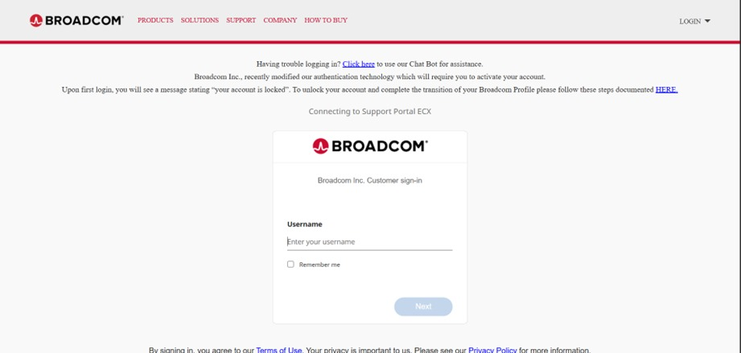

---

# 🟦 3. Registro en Broadcom

Si no tienes una cuenta, regístrate en:

🔗 https://profile.broadcom.com/web/registration

Completa el formulario con tus datos personales.

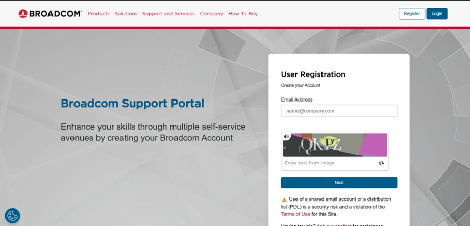

---

# 🟦 4. Acceso a My Downloads

Una vez dentro del panel principal, selecciona:

➡️ **My Downloads**

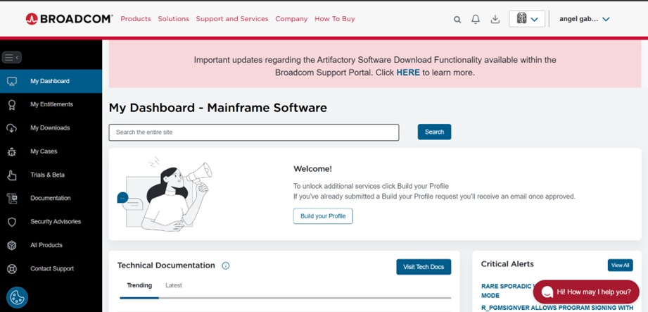

---

# 🟦 5. Descargas gratuitas

Dentro del panel de descargas, selecciona:

➡️ **Free Software Downloads Available HERE**

---

# 🟦 6. Selección de VMware Workstation Pro

Busca y selecciona:

➡️ **VMware Workstation Pro**

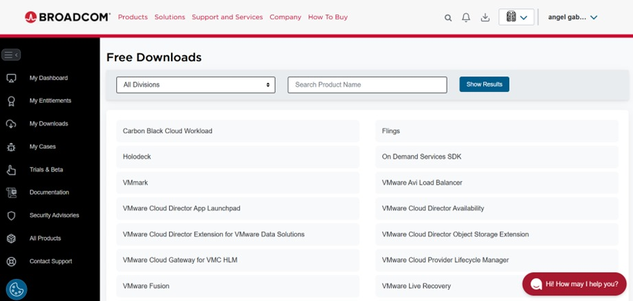

---

# 🟦 7. Elección del sistema operativo

Selecciona el sistema operativo en el que deseas instalar VMware Workstation Pro.  
En este caso:

➡️ *VMware Workstation Pro 17.0 for Windows*

---

# 🟦 8. Selección de versión

Se recomienda instalar la versión más reciente y estable:

➡️ **Versión 17.6.4**

---

# 🟦 9. Aceptación de términos

Antes de descargar, haz clic en:

➡️ **Terms and Conditions**

Debes abrir el documento para habilitar la casilla de aceptación.

---

# 🟦 10. Descarga del instalador

Desplázate hacia abajo y selecciona el icono de **descarga (nube)**.

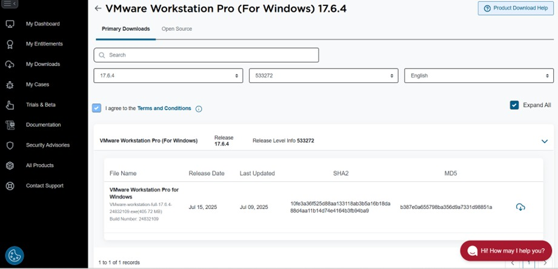

---

# 🟦 11. Confirmación de descarga

Se mostrará un mensaje donde debes aceptar:

➡️ **Accept**

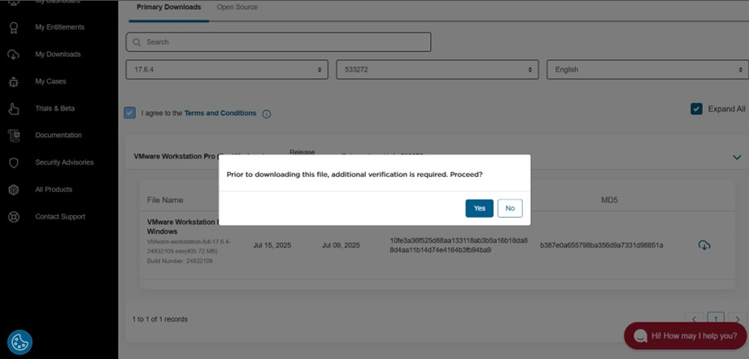

---

# 🟦 12. Formulario requerido

Antes de iniciar la descarga final, aparecerá un formulario.  
Dato obligatorio:

✔ ZIP / Postal Code  

Luego haz clic en **Submit**.

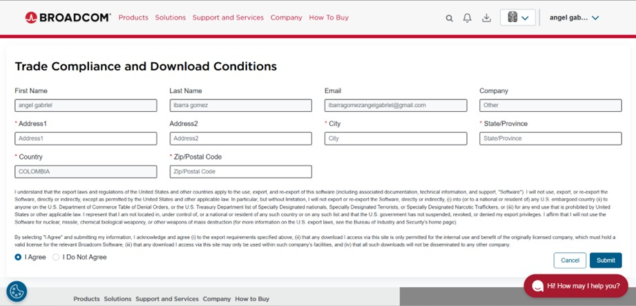

---

# 🟦 13. Inicio de descarga final

Después de enviar el formulario, regresarás a la pantalla anterior.  
Haz clic nuevamente en el icono de descarga.

---

# 🟦 14. Instalación del programa

Una vez descargado el instalador, ejecútalo.  
A continuación, sigue estos pasos:

---

## ✔ Aceptar condiciones iniciales

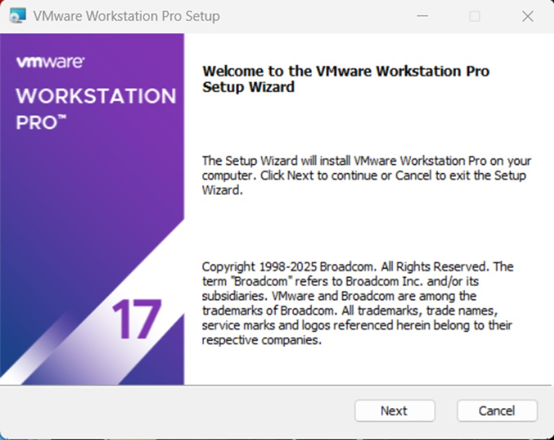

---

## ✔ Aceptar nuevamente

---

## ✔ Marcar la casilla de conformidad

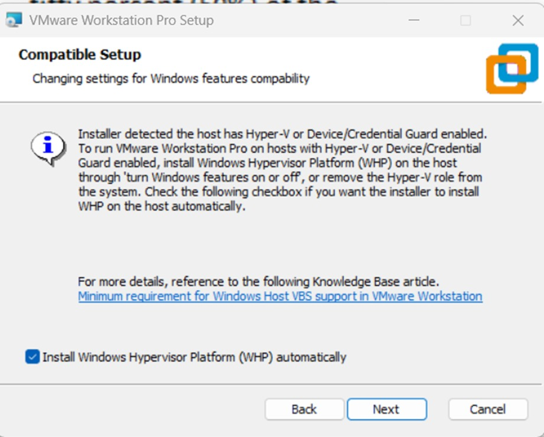

---

## ✔ Continuar con Next

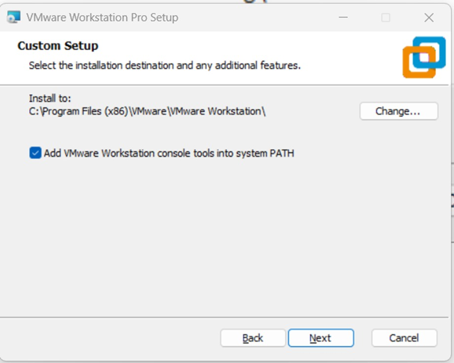

---

## ✔ Desactivar envío de datos

Desmarca la opción:

❌ *Join the VMware Customer Experience Improvement Program*

---

## ✔ Configuración adicional

Desactiva la segunda casilla y selecciona **Next**.

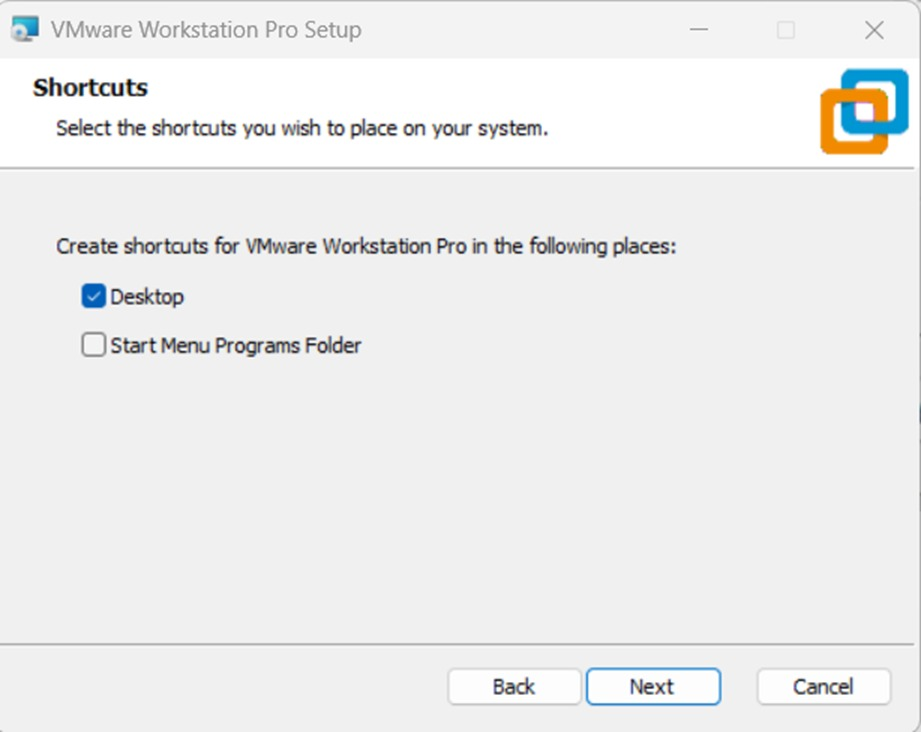

---

## ✔ Instalar el programa

Haz clic en:

➡️ **Install**

---

## ✔ Finalizar instalación

Haz clic en:

➡️ **Finish**

---

# 🟦 15. Verificar la instalación

Una vez abierto VMware Workstation Pro, verifica la versión instalada:

➡ **Help → About VMware Workstation**

---

# 🎉 Instalación completada

Ya tienes VMware Workstation Pro instalado y listo para usar en su versión gratuita.

Si deseas, puedo:
- Crear un README aún más profesional para todo tu proyecto  
- Añadir estilos avanzados  
- Generar versión PDF  
- Crear índices por secciones para cada herramienta del SOC  

¿Quieres continuar con eso?
